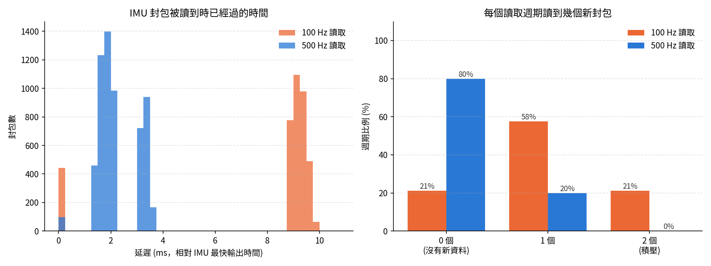

# SPI IMU + Encoder 同步讀取測試報告

測試日期：2026-10-04
韌體：`mbed/multi_imu_sync`　分析程式：`python/imu/multi_imu_sync_check.py`

## 1. 測試設定

| 項目 | 設定 |
|---|---|
| 控制器 | NUCLEO-F446RE (180 MHz) |
| IMU | Xsens MTi-2 × 1 (DeviceID 02886A7B)，SPI2 (PB13/14/15)，CS = PB_1，SPI 1 MHz，mode 3 |
| IMU 輸出 | 100 Hz，封包含 PacketCounter、SampleTimeFine、Euler、Acceleration、RateOfTurn、StatusWord |
| Encoder | 12-bit 絕對式 SPI encoder × 1，SPI1 (D3/D4/D5)，CS = D9，SPI 1 MHz，mode 2 |
| 讀取方式 | MCU 以固定頻率 (Ticker) 讀 encoder，接著輪詢 IMU，有新封包就讀出 |
| 測試條件 | 讀取頻率 **500 Hz** 與 **100 Hz** 各錄 60 秒，IMU 與 encoder 靜止 |

**檢查方法**

- **漏讀**：IMU 每個封包帶有 PacketCounter (每封包 +1)，檢查是否連續。
- **調包**：每條 CS 初始化時讀 DeviceID；PacketCounter 與 SampleTimeFine (IMU 內部時鐘，0.1 ms) 若被別顆資料混入會出現不連續的跳動。
- **同步性**：錄製前後各做一次 2 秒的快速輪詢 (約 50 µs 一次)，記錄每個封包的到達時間與 SampleTimeFine，求出 IMU 時鐘與 MCU 時鐘的換算關係，再算出每個封包被讀到時已經過了多久。

## 2. 結果總表

| 項目 | 500 Hz 讀取 | 100 Hz 讀取 |
|---|---|---|
| 讀取週期 | 2000.0 µs，標準差 6.8 µs | 10000.0 µs，標準差 0.0 µs |
| 60 秒週期數 / 遺失 | 29998 / **0** | 6001 / **0** |
| 每週期處理時間 (平均 / 最大) | 458 / 1476 µs (最高佔週期 74%) | 1475 / 2766 µs (28%) |
| IMU 封包數 | 6000 (預期 6000) | 6000 (預期 6000) |
| **IMU 漏讀** | **0** | **0** |
| PacketCounter 異常跳動 | 0 | 0 |
| SampleTimeFine 異常 (間隔 ≠ 10 ms) | 0 | 0 |
| IMU 讀取錯誤 (格式 / checksum) | 0 | 0 |
| **調包** | **無** (DeviceID 正確、計數連續) | **無** |
| 週期內沒有新 IMU 資料 | 80% (正常，IMU 只有 100 Hz) | **21%** |
| 週期內一次讀到 2 個封包 (積壓) | 0% | **21%** |
| IMU 封包被讀到時已過時間 (平均 / 95% / 最大) | **2.2 / 3.5 / 3.7 ms** | 6.6 / 9.6 / 10.0 ms |
| encoder 讀取時刻 → IMU 開始讀取 | 33 µs | 32 µs |
| encoder 讀取 (bit15 錯誤) | 29998 次 / 0 錯誤 | 6001 次 / 0 錯誤 |
| IMU 時鐘相對 MCU | −18 ppm | −23 ppm |



各頻率的詳細圖表：[500hz/multi_imu_sync.png](500hz/multi_imu_sync.png)、[100hz/multi_imu_sync.png](100hz/multi_imu_sync.png)

## 3. 結論

1. **沒有漏讀、沒有調包。** 兩種頻率下 60 秒共 6000 個 IMU 封包全部讀到且只讀到一次，PacketCounter 與 SampleTimeFine 完全連續，SPI 讀取 0 錯誤；encoder 0 錯誤。

2. **建議用 500 Hz 讀取。** 100 Hz 讀取時 MCU 與 IMU 兩個獨立的 100 Hz 時鐘互相飄移，21% 的週期拿不到新資料、另外 21% 的週期一次積壓 2 筆，資料延遲在 0～10 ms 間跳動。500 Hz 讀取時每個封包都在下一個 2 ms 週期內被讀到，沒有積壓，延遲縮短到 3.7 ms 以內。

3. **IMU 與 encoder 的取樣時間差。** 同一個週期內 encoder 與 IMU 的讀取只差約 33 µs，但 IMU 本身只以 100 Hz 產生資料，所以「encoder 讀數」與「同一週期拿到的最新 IMU 樣本」在時間上本來就差 0～10 ms (加上上述讀取延遲)。若需要逐筆對齊，應使用封包內的 SampleTimeFine 時間戳換算，而不是假設兩者同時取樣。

4. **延遲數字的意義。** 「已過時間」是以 IMU 最快輸出的那一刻為零點，不含 IMU 內部固定的處理時間 (無法從外部量到)。校準資料顯示 IMU 準備好封包的時間本身有約 0～2.5 ms 的抖動，因此 500 Hz 下最大延遲 (3.7 ms) 會超過一個讀取週期 (2 ms)。

## 4. 發現的問題與後續建議

**(a) Encoder 讀值不穩定，需要確認。** 靜止時 encoder 讀值在 25 個不同數值間跳動 (約 9°～20°)，雖然 bit15 檢查全部通過，但數值本身不可信。本報告只驗證了 encoder 的「通訊時序」，**未驗證角度數值的正確性**。需確認：
- 目前接的 encoder 型號與資料格式 (程式假設 12-bit、`(raw >> 3) & 0x0FFF`、bit15 恆為 1)；若已換成預計串接 (daisy chain) 的 encoder，格式可能不同。
- 磁鐵與晶片的對位、SPI mode。

**(b) 擴充到 5 顆 IMU 時，500 Hz 的時間預算不夠。** 讀一顆 IMU 的一個封包約需 1.4 ms (其中理論傳輸時間約 0.65 ms，其餘是逐 byte 呼叫的軟體開銷)。5 顆 IMU 的封包若剛好落在同一個週期，最多需約 7 ms，超過 2 ms 週期。可行做法：
- 改用整塊傳輸 (`spi.write(tx, len, rx, len)` 或 DMA) 減少每 byte 開銷；
- 在 MT Manager 移除用不到的輸出 (例如 StatusWord) 縮短封包；
- 確認 MTi-2 支援的最高 SPI 時脈，必要時提高；
- 若仍不足，可把 IMU 分到 SPI2、SPI3 兩組，或改用每週期只讀部分 IMU 的排程。

**(c) 序列埠輸出頻寬。** 5 顆 IMU × 500 Hz 的逐週期文字輸出約 125 kB/s，超過 921600 baud。之後的測試韌體需改成只在有新 IMU 資料時輸出。

**(d) 多顆 IMU 之間的同步。** MTi 沒有外部同步時各顆以自己的時鐘取樣，彼此相差 0～10 ms 並會緩慢飄移 (本次單顆 IMU 相對 MCU 約 −20 ppm)。若需要多顆 IMU 同時取樣，需使用 SyncIn 由 MCU 送出觸發訊號。

**(e) 接線。** 測試過程中確認：多顆 IMU 經麵包板共用 SPI 時會因接觸不良出現 CS 失控與位元錯誤，單獨直接接線則完全正常。正式系統建議使用焊接的匯流排，並在每條 CS 加 10 kΩ 上拉至 3.3 V。

## 5. 重現方式

```bash
cd python/imu
python3 multi_imu_sync_check.py --bus-check              # 先確認匯流排
python3 multi_imu_sync_check.py --rate 500 --seconds 60  # 500 Hz 測試
python3 multi_imu_sync_check.py --rate 100 --seconds 60  # 100 Hz 對照
```

原始資料：`500hz/`、`100hz/` 內的 `multi_imu_sync_raw.csv` (每週期一列) 與 `multi_imu_sync_cal.csv` (時間校準)。
